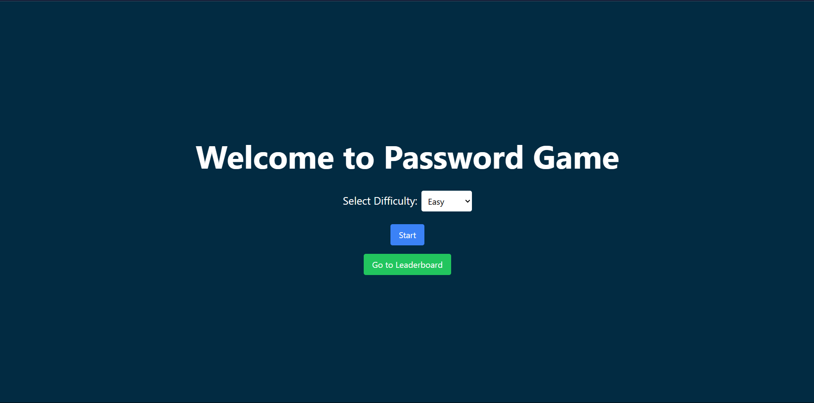
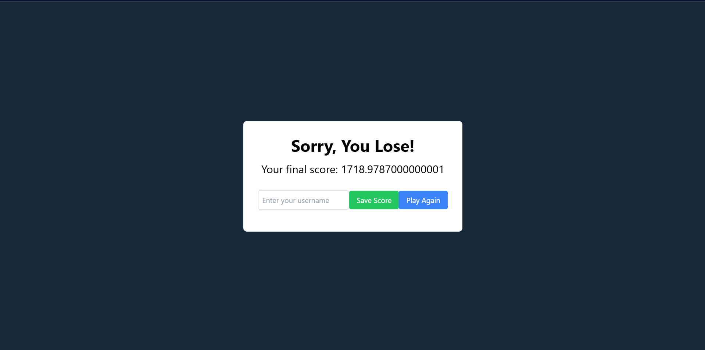

# **Password Game**

## **Deskripsi Aplikasi**

Password Game adalah sebuah aplikasi web interaktif di mana pemain harus membuat password yang memenuhi berbagai aturan (rules) tertentu. Pada permainan ini terdapat 20 rules yang harus dipenuhi oleh pemain agar dapat memenangkan permainan ini. Terdapat beberapa kondisi yang dapat membuat pemain ini juga kalah. Pemain dapat mendapatkan score total yang didapat ketika pemain telah kalah atau berhasil menang.

## **Teknologi, Bahasa, dan Framework yang Digunakan**

- **Frontend:**
  - **React.js**: Digunakan untuk membangun antarmuka pengguna yang dinamis dan interaktif.
  - **Tailwind CSS**: Untuk styling dan pengaturan layout.

- **Backend:**
  - **Node.js**: Digunakan sebagai server-side runtime untuk menjalankan JavaScript di server.
  - **Express.js**: Web framework untuk Node.js yang digunakan untuk mengatur routing dan middleware.

- **Database:**
  - **SQLite**: Database ringan yang digunakan untuk menyimpan gambar captchas dan bendera .

- **Docker**:
  - Digunakan untuk meng-containerize aplikasi, memastikan bahwa aplikasi dapat berjalan dengan konsisten di berbagai lingkungan.

## **Struktur Program**

```plaintext
Password_Game/
│ 
├── backend/
│ ├── src/
│ │ ├── server.js
│ │ ├── database.js
│ │ └── rules/
│ │ ├── rule_1.js
│ │ ├── rule_20.js
│ │ └── ...
│ ├── package.json
│ ├── Dockerfile
│ └── ...
│
├── frontend/
│ ├── src/
│ │ ├── components/
│ │ ├── App.js
│ │ ├── index.js
│ │ └── ...
│ ├── public/
│ ├── package.json
│ ├── Dockerfile
│ └── ...
│
├── images/
│ ├── tampilan-game-over.png
│ ├── tampilan-inGame.png
│ ├── tampilan-utama.png
│
├── docker-compose.yml
└── README.md
```
- **Backend (`backend/`)**: Berisi seluruh kode untuk server, termasuk API untuk komunikasi dengan frontend dan database, serta file rule untuk validasi password.
- **Frontend (`frontend/`)**: Berisi seluruh kode untuk tampilan aplikasi dan logika yang berjalan di sisi klien.
- **Dockerfile**: Konfigurasi untuk membuild image Docker dari backend dan frontend.
- **docker-compose.yml**: File konfigurasi untuk mengorkestrasi container backend dan frontend.

## **Penjelasan dan Penggunaan Algoritma**

### **Algoritma String Matching**

**Regex (Regular Expressions)**

### **Alasan Pemilihan Algoritma**

Saya memilih menggunakan regex (regular expressions) pada permainan ini karena regex menawarkan fleksibilitas dan kemudahan yang lebih besar dalam menangani berbagai rules password yang rumit dan sering berubah. Dengan regex, saya dapat dengan mudah membuat pola yang kompleks dan langsung dalam kode. Regex memungkinkan penyesuaian aturan dengan cepat tanpa perlu mengubah algoritma secara besar-besaran, sehingga memudahkan pengembangan dan pemeliharaan game password ini. Dengan regex, saya bisa lebih leluasa menghadapi berbagai kondisi dan pola yang dinamis.

## **Cara Menjalankan Program**

### **Prasyarat**

**Docker**: Pastikan Docker sudah terinstall di sistem Anda.

### **Langkah-langkah**

1. **Clone Repository**:
   ```bash
   git clone https://github.com/username/password-validation-game.git
   cd password-validation-game

2. **Build dan Jalankan Aplikasi**:
   ```bash
   docker-compose up --build
3. **Akses Aplikasi**:
   Buka browser dan akses http://localhost:3000 untuk frontend.
   Backend akan berjalan di http://localhost:5000.

## **Tangkapan Layar**
1. Halaman Utama
    
   Deskripsi: Interface utama di mana pemain dapat memulai permainan.

3. Halaman Permainan
   
   Deskripsi: Tampilan di mana pemain harus memasukkan password yang sesuai dengan aturan yang diberikan.

5. Halaman Ketika GameOver
   
   Deskripsi: Tampilan ketika permainan telah selesai.
   
## **Referensi Belajar**
- React Documentation: https://reactjs.org/docs/getting-started.html
- Node.js Documentation: https://nodejs.org/en/docs/
- Express.js Documentation: https://expressjs.com/en/starter/installing.html
- Docker Documentation: https://docs.docker.com/
- SQLite Documentation: https://sqlite.org/docs.html
- Regex (Regular Expressions) Algorithm: https://www.geeksforgeeks.org/kmp-algorithm-for-pattern-searching/
